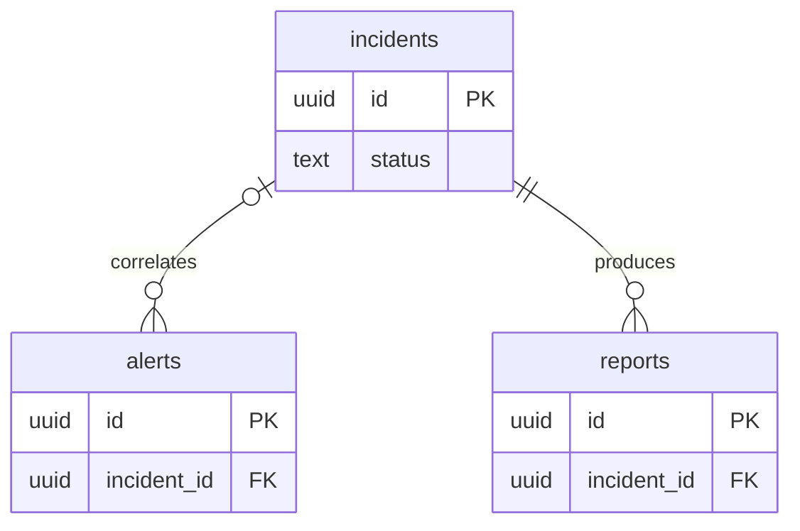

# Oiva Agent

The [Mastra](https://mastra.ai/) Agent application at the heart of Oiva. It receives a
Honeycomb alert webhook, runs a multi-agent investigation across the user's telemetry and codebase, writes a structured incident report, and posts it to Slack. Throughout the workflow, live progress updates are surfaced to the user in the incident message on Slack.

For full-system setup (Docker, Postgres, OTel Collector, environment keys, and
the Honeycomb alert webhook contract), see the [local development guide](local-dev.md). This document covers the agent package itself.

## Development

First-time setup:

```bash
npm install        # install dependencies
npm run db:migrate # apply Postgres migrations
npm run dev        # Mastra Studio at http://localhost:4111
```

`npm run dev` boots without Postgres, but `db:migrate` and any real investigation need it. Start it from the project root with `docker compose up -d postgres` before migrating (see the [local development guide](local-dev.md)).

Other commands:

```bash
npm test     # run the Vitest suite
npm run reap # run the cleanup reaper for stale incidents
```

## Incident workflow

A single Mastra workflow, `oivaWorkflow`, orchestrates each incident through
four steps:

1. **announce** — opens a Slack thread for the incoming alert and posts the
   initial incident card as the main message.
2. **investigate** — the **Supervisor Agent** orchestrates the investigation, delegating
   to two sub-agents, analyzing and synthesizing their findings together:
   - **Telemetry Agent** — explores Honeycomb datasets, runs queries, compares
     anomalies against baselines, and pulls relevant telemetry evidence (such as traces) via the Honeycomb MCP.
   - **Codebase Agent** — examines the user's codebase by cloning the target repository into a Mastra workspace and inspecting it with local tools: filesystem navigation, Git history, LSP, and BM25 search.
3. **report** — the **Report Agent** turns the Supervisor Agent's gathered investigation findings into a structured incident report that is persisted in a Postgres database.
4. **send-report** — posts the final report back to the Slack thread.

Progress is surfaced live in Slack through the `ProgressReporter` port, so the thread reflects which phase the incident workflow is in, including the subagent investigations.

## Data model

Three Postgres tables hold incident state. This is a conceptual summary. The source of truth is the migrations under `src/agent/src/mastra/db/migrations/`.



- An **alert** optionally links to an incident (detached if the incident is deleted).
- A **report** always belongs to an incident (deleted with it).

## Project layout

All Mastra code lives under `src/agent/src/mastra`. `src/agent/src/mastra/index.ts` is the entry
point that wires everything together and registers the alert and Slack webhook
routes.

| Folder          | Description                                                                                                                 |
| --------------- | --------------------------------------------------------------------------------------------------------------------------- |
| `api/`          | Honeycomb alert + Slack interaction webhook handlers and adapters.                                                          |
| `workflows/`    | The main `oivaWorkflow` and `alertEnrich` for alert contextualization.                                                      |
| `agents/`       | Supervisor, telemetry, codebase, and report agents.                                                                         |
| `prompts/`      | Custom system prompts for each agent.                                                                                       |
| `tools/`        | Reusable tools (alert enrichment, investigation tool wrapper).                                                              |
| `mcp/`          | Hosted MCP client for Honeycomb (telemetry tools).                                                                          |
| `workspaces/`   | Per-agent sandboxed workspaces and knowledge-base sync.                                                                     |
| `memory/`       | Investigation memory schema.                                                                                                |
| `domain/`       | Core domain types and logic — incident/alert/report schemas, the incident state machine, correlation, and duration helpers. |
| `services/`     | Incident service and the cleanup reaper + scheduler.                                                                        |
| `ports/`        | Interfaces for repositories and the progress reporter (ports/adapters).                                                     |
| `repositories/` | Postgres implementations of the alert, incident, and report repositories.                                                   |
| `db/`           | Postgres client, SSL config, types, and migrations.                                                                         |
| `slack/`        | Slack client, message formatters, and the progress reporter for incident updates.                                           |
| `config/`       | Environment parsing and Postgres configuration.                                                                             |
| `runtime/`      | Process lifecycle (graceful shutdown handling).                                                                             |
